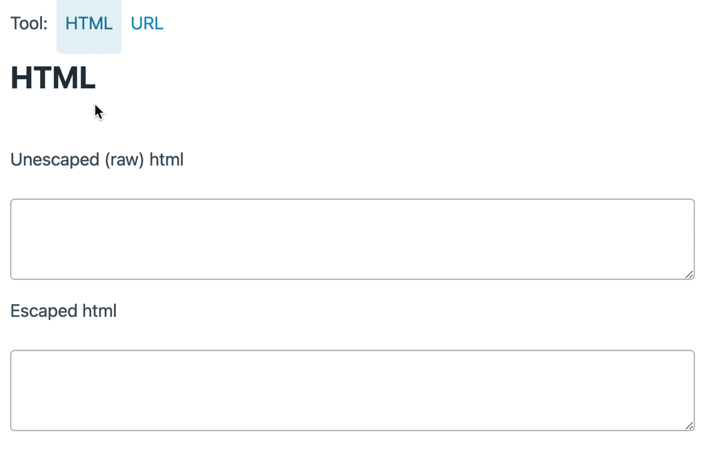

# encoding tools

One day, I got sick of googling `encode html` and find pages and pages of tools that'll do the job after you figure out which box to put your stuff in and which button to tap.

But really, we can afford the few CPU cycles to just process on change and copy/paste can't we? So here is a teeny tine one-stop tool for your basic encoding/escaping needs that is quicker.

Use it live at [https://ddikman.github.io/encode-tools/](https://ddikman.github.io/encode-tools/)

Enjoy.

## Supported

- BASE64
- URLs
- HTML
- Unicode (same as urls)